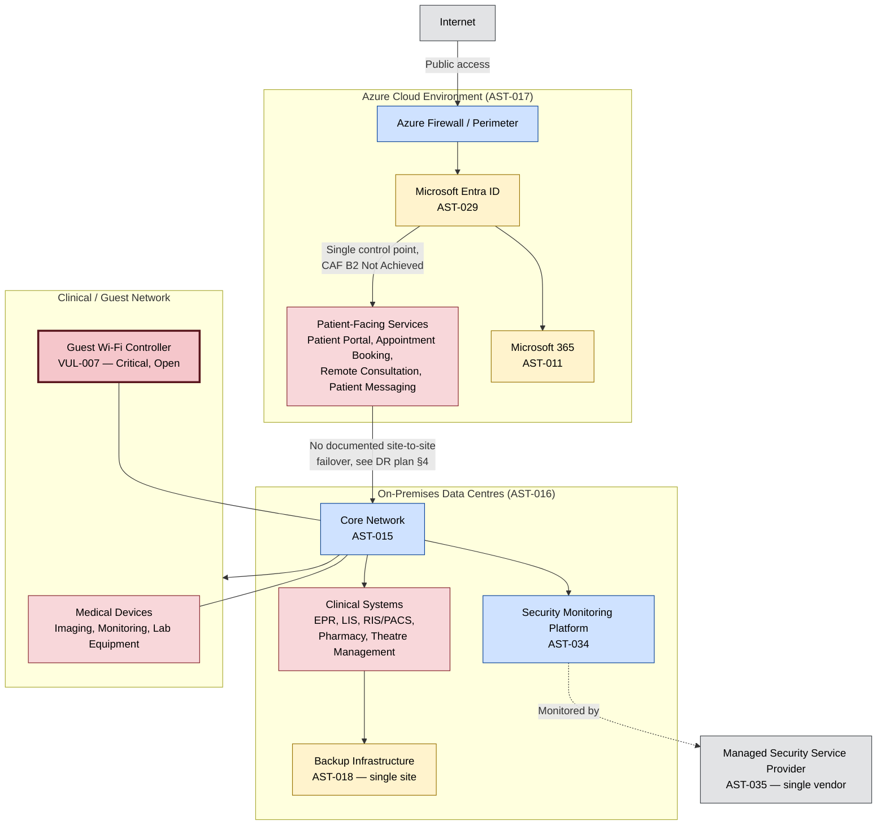

# Network and Infrastructure Architecture Diagram

**Organisation:** Westbridge Hospitals Trust (WHT)
**Document Type:** Architecture Diagram
**Owner:** Infrastructure Manager
**Version:** 1.0

## Purpose

This diagram shows the Trust's high-level network and infrastructure estate — on-premises data centres, the core network, and the Azure Cloud Environment — and how the infrastructure-category assets in [../../02-Asset-Management/021-digital_asset_estate.md](../../02-Asset-Management/021-digital_asset_estate.md) §4 connect to each other. It is referenced by [../../04-Risk-Management/041-cloud_risk.md](../../04-Risk-Management/041-cloud_risk.md), [../../09-Security-Operations/093-secure_baseline.md](../../09-Security-Operations/093-secure_baseline.md), and [../../10-Business-Continuity/102-disaster_recovery_plan.md](../../10-Business-Continuity/102-disaster_recovery_plan.md), each of which describes part of this estate in text but does not show how the parts connect.

This diagram is useful for:

- CAF B4/B5 → system security and resilient networks and systems.
- Business continuity and disaster recovery planning → understanding single points of failure.
- Incident response → scoping containment actions against actual network boundaries.

## Colour Convention

Zones are coloured by data sensitivity, consistent with [../../06-Information-Governance/061-data_classification.md](../../06-Information-Governance/061-data_classification.md) §4, matching the convention already used in [../../06-Information-Governance/Data_Flow_Diagrams/](../../06-Information-Governance/Data_Flow_Diagrams/).

## Diagram

## What This Diagram Makes Visible

Two structural weaknesses are easier to see here than in any single text document: first, Microsoft Entra ID sits as a single control point between the internet boundary and every patient-facing service — the identity single-point-of-failure finding in [../../04-Risk-Management/041-cloud_risk.md](../../04-Risk-Management/041-cloud_risk.md) §4.2 is a direct consequence of this topology, not an abstract governance statement. Second, Backup Infrastructure (AST-018) and the clinical network both terminate at the same on-premises core, with no secondary site shown — this is the single-site dependency behind [../../10-Business-Continuity/102-disaster_recovery_plan.md](../../10-Business-Continuity/102-disaster_recovery_plan.md) REC-004.

## Review and Maintenance

This diagram is reviewed annually by the Infrastructure Manager, or immediately following a material change to network topology, a new Azure landing zone (see [../../12-Azure-Governance/121-azure_governance_assessment.md](../../12-Azure-Governance/121-azure_governance_assessment.md) AZG-REC-001), or an update to the master asset register.
