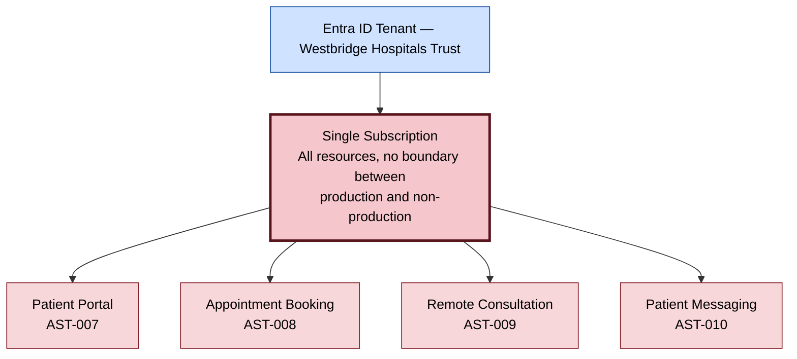
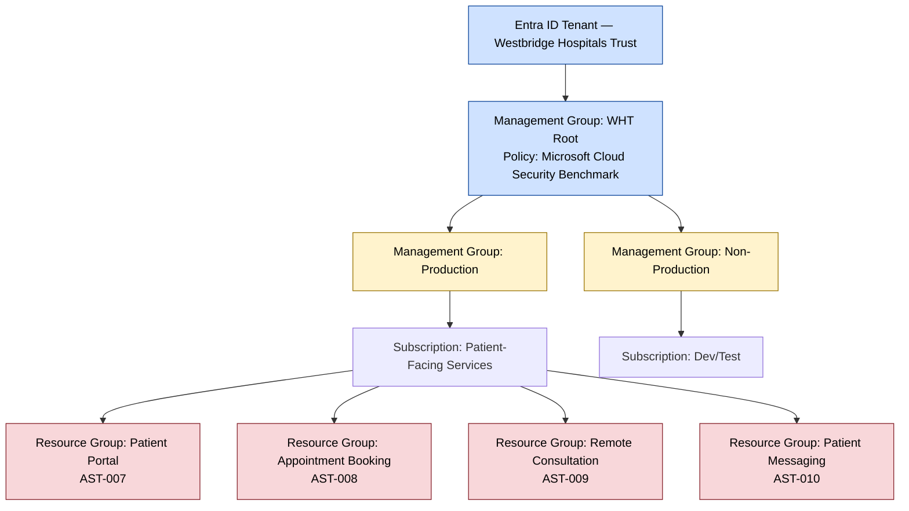

# Azure Management Group Hierarchy Diagram — Current vs Target

**Organisation:** Westbridge Hospitals Trust (WHT)
**Document Type:** Architecture Diagram
**Owner:** Cloud Service Owner
**Version:** 1.0

## Purpose

This diagram visualises the specific structural gap identified in [../../12-Azure-Governance/121-azure_governance_assessment.md](../../12-Azure-Governance/121-azure_governance_assessment.md) §4.1: a single flat Azure subscription with no management group hierarchy, versus the target state that recommendation AZG-REC-001 would deliver. It is intended to be read alongside that assessment, not as a replacement for its narrative findings.

## Diagram — Current State

No scope exists here at which an Azure Policy or RBAC model could be assigned once and inherited across all four applications — this is the root cause behind observations 4.1–4.3 in the governance assessment.

## Diagram — Target State (AZG-REC-001)

In the target state, RBAC and Azure Policy are assigned once at the Management Group level (closing AZG-REC-002 and AZG-REC-003) and inherited by every resource group beneath it, rather than being configured — or missed — application by application.

## Review and Maintenance

Reviewed alongside [../../12-Azure-Governance/121-azure_governance_assessment.md](../../12-Azure-Governance/121-azure_governance_assessment.md); the "Current State" diagram above should be deleted once AZG-REC-001 is delivered and only the target state remains accurate.
