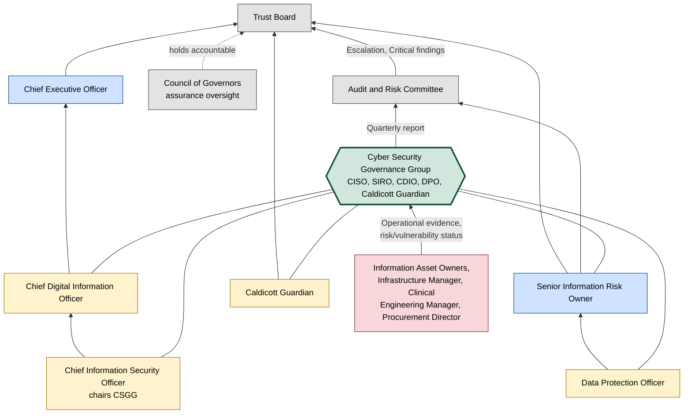

# Cyber Security Governance Reporting Structure Diagram

**Organisation:** Westbridge Hospitals Trust (WHT)
**Document Type:** Governance Diagram
**Owner:** CISO (Chief Information Security Officer)
**Version:** 1.0

## Purpose

This diagram visualises the reporting lines set out in table form in [../../05-Governance/052-roles_and_responsibilities.md](../../05-Governance/052-roles_and_responsibilities.md) §2, so a reader can see at a glance how an issue raised at CSGG level reaches the Trust Board, and which roles sit on the Cyber Security Governance Group (CSGG) itself. It is also referenced by [../../11-Audit/111-internal_audit_report.md](../../11-Audit/111-internal_audit_report.md) AUD-006, which notes the Trust has not yet formally documented a Three Lines Model alongside this structure.

## Diagram

## What This Diagram Makes Visible

The CSGG sits below the Trust Board and reports through the Audit and Risk Committee, which is the correct escalation path for Critical findings per [../../11-Audit/111-internal_audit_report.md](../../11-Audit/111-internal_audit_report.md) §4. What the diagram also makes visible is the gap that finding AUD-006 describes in words: there is no separate, independent Internal Audit function shown here distinct from the CSGG's own second-line reporting — the same group that manages the risks also reports on them, with no chartered third-line function in between until [../../14-RoadMap/141-cyber_security_roadmap.md](../../14-RoadMap/141-cyber_security_roadmap.md) INIT-11 is delivered.

## Review and Maintenance

Reviewed annually by the CISO alongside [../../05-Governance/052-roles_and_responsibilities.md](../../05-Governance/052-roles_and_responsibilities.md), or immediately following a change to CSGG membership or reporting lines, including the addition of a chartered Internal Audit function (INIT-11) or Business Continuity Manager CSGG membership (per [../../10-Business-Continuity/101-business_continuity_plan.md](../../10-Business-Continuity/101-business_continuity_plan.md) REC-002).
